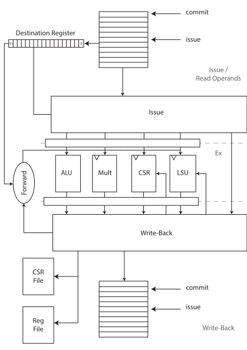

# Out-of-Order

In this lab, you will be asked several questions to verify your understanding of Out-of-Order.

## Prelab

Read through the [CVA6 Execute Stage Documentation](https://docs.openhwgroup.org/projects/cva6-user-manual/03_cva6_design/ex_stage.html) and the [CVA6 Issue Stage Documentation](https://docs.openhwgroup.org/projects/cva6-user-manual/03_cva6_design/issue_stage.html), and use them to answer the following questions.

1. What is the purpose of Out-of-Order?
2. Give a brief explanation of Scoreboarding and Tomasulo's Algorithm. What are the pros and cons of each? Which OoO strategy does CVA6 use? (Extra: [Tomasulo's original paper](https://ieeexplore.ieee.org/document/5392028))
3. CVA6's rename unit will not be enabled for this lab. However, provide pseudocode that would run faster assuming the rename unit was enabled.
4. CVA6 has 7 functional units in [`"ex_stage.sv"`](https://github.com/openhwgroup/cva6/blob/master/core/ex_stage.sv): ALU, Branch Unit, LSU, Multiplier, CSR Buffer, [FPU](https://github.com/openhwgroup/cvfpu), and [CVXIF](https://github.com/openhwgroup/core-v-xif). For each of the 7 functional units, provide:
    1. A brief explanation of its function.
    2. Which instructions it handles.
    3. How many cycles it takes to execute. (You don't have to do this question for the FPU and CVXIF).
5. Briefly describe when the following hazards can occur:
    1. Read-Write (RAW)
    2. Write-Write (WAW)
    3. Write-Read (WAR)
6. Using the following diagram of the CVA6 backend, explain the path that an instruction must take through the issue and execute stage. Be sure to include the issue queue, transaction IDs, source operands, the destination register, `rd_clobber`, the scoreboard, and any other important logic in your explanation.

    

7. After looking through the issue stage and scoreboard RTL, Provide a GitHub permalink to the following in CVA6:
    1. The issue queue instantiation
    2. The logic that specifies if a functional unit is ready to execute a new instruction
    3. The logic that stalls the pipeline due to the execute stage being too full for the next instruction
    4. The logic that determines which instruction(s) will be committed on the next cycle

## Part 1

Write a program that demonstrates the following situations:

* Out-of-Order Execution
* Read-Write hazard
* Write-Write hazard
* Write-Read hazard
* A branch miss
* The issue queue full

Note:

* No more than 1 fixed latency unit operation (`ALU`, `CTRL_FLOW`, `CSR`, `MULT`) can be run simultaneously.
* No more than 1 floating point unit operation (`FPU`, `FPU_VEC`) can be run simultaneously.
* No more than 1 load-store unit operation (`LOAD`, `STORE`) can be run simultaneously.

To enable out-of-order execution, your program must use a mix of instructions from the 3  functional unit types.

An example of how to run RISC-V floating point instructions (RVF) is provided here: [`"fpu_example.S"`](https://github.com/sifferman/labs-with-cva6/blob/main/programs/rvf/fpu_example.S)

## Part 1 Questions

When providing screenshots of waveforms, please include all signals you decide are relevant to demonstrate the event. Improper justification will result in a lower score.

1. Share your program. Be sure each situation is clearly commented.
2. Provide a waveform screenshot and a brief explanation of how the issue queue is affected for each of the following situations:
    1. Out-of-Order Execution
    2. Read-Write hazard
    3. Write-Write hazard
    4. Write-Read hazard
    5. A branch miss
    6. The issue queue full

## Part 2

In this part, you will implement a synchronous FIFO.

FIFOs (first-in-first-out queues) are incredibly popular in pipelined architecture designs. Usually, if two hardware units with different clock frequencies/latencies need to communicate, the faster unit must stall and wait for the slower unit to be ready to prevent data loss. Fortunetly, a FIFO can be added between the two units to buffer the requests so that the faster unit will stall only when the FIFO is full, and the slower unit can grab available data as soon as it is ready. This strategy can provide incredible speedup when a lot of different types of hardware units need to communicate. (CVA6 uses several FIFOs in its design.)

You should implement your FIFO with a cyclical buffer. You should have one block ram of size `DATA_WIDTH` and `NR_ENTRIES`, with pointers to your FIFO `head` and `tail`. Here are some specifics:

* When you pop an element, you should increment the `head` pointer.
* When you push an element, you should write `data_i` to the tail of the buffer, and increment the `tail` pointer.
* If the `head` or `tail` pointer reach `NR_ENTRIES`, they should reset to `0`.
* You can push and pop on the same cycle, but if the FIFO is empty, you should only push.
* If the FIFO is empty, `valid_o` should output `0`, and any pop requests should fail.
* If the FIFO is full, `full_o` should output `1`, and any push request should fail unless a pop request is also active.
* As long as the FIFO is not empty, `data_o` should give the data at the head of the buffer.
* Both pushing and popping should occur on `posedge clk_i`, and reset should occur synchronously.

The module you need to finish is [`"ucsbece154b_fifo.sv"`](https://github.com/sifferman/labs-with-cva6/blob/main/labs/ooo/part2/starter/ucsbece154b_fifo.sv), found in [`"labs/ooo/part2/starter"`](https://github.com/sifferman/labs-with-cva6/tree/main/labs/ooo/part2/starter). You can simulate your changes with ModelSim using `make tb TOOL=modelsim` (or Verilator 5 using `make tb TOOL=verilator` assuming that you have it set up). A [sample testbench](https://github.com/sifferman/labs-with-cva6/blob/main/labs/ooo/part2/starter/tb/fifo_tb.sv) is provided that you may edit as desired. You will also be graded on whether your design is synthesizable. You can run `make synth` to verify that it synthesizes with Yosys+Surelog correctly.

Now that you have seen a lot of CVA6's code, **you must mimic the coding practices/styles of CVA6**. This means using `_d` and `_q` nets for all your flip-flops, and using `always_comb` to set your `_d` nets, and using `always_ff` to set your `_q` nets.

Note that for your buffer to infer a block ram, you cannot separate it into `_d` and `_q` nets. This is because if your `always_ff` block has `<ARRAY>_q <= <ARRAY>_d;`, your array will be inferred as an array of registers. To be inferred as a block ram, you must do `if (<WE>) <ARRAY>[<ADDR>] <= <DATA>;` instead.
